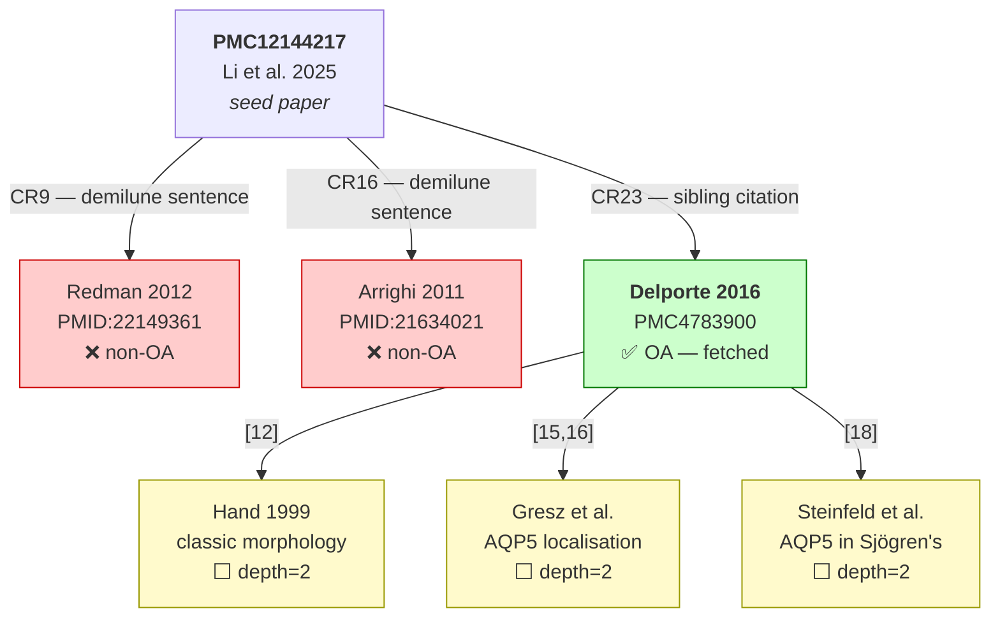
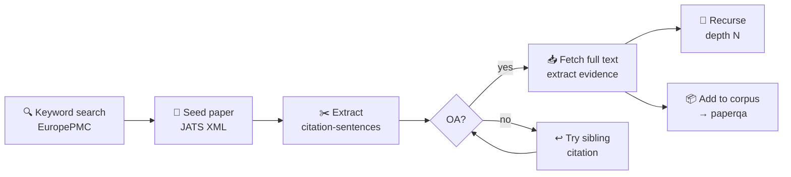

# Citation Traversal — Proof of Concept Experiment

## Overview

This document records a live proof-of-concept demonstrating citation traversal
over JATS XML from EuropePMC. The goal was to validate that a scholarly citation
workflow — find a relevant sentence in a paper, follow the citation to primary
evidence, extract useful content — can be executed programmatically without any
pre-built infrastructure beyond throwaway scripting.

---

## Method

### Step 0 — Seed paper selection

Searched EuropePMC for salivary gland atlas / scRNA-seq papers mentioning demilune
cells. Selected candidate open-access papers with JATS XML available:

```
Query: "salivary gland demilune serous acinar cell biology"
```

Candidates screened for:
- JATS full text available (`inEPMC: Y`)
- Inline bibliographic `<xref ref-type="bibr">` tags present
- Text mentioning "demilune"

**Seed paper selected:** Li ZZ et al. (2025). *Applied anatomy and morphology of
minor salivary glands in commonly used experimental animals.* Sci Rep 15:20016.
**PMCID: PMC12144217** — 31 citation xrefs, demilune mentioned.

### Step 1 — JATS XML fetch and citation-sentence extraction

Fetched raw JATS XML directly from EuropePMC:

```
https://www.ebi.ac.uk/europepmc/webservices/rest/PMC12144217/fullTextXML
```

Parsed with Python's `xml.etree.ElementTree`. Key steps:

1. Built a reference lookup: `rid → full reference text` from `<ref-list>`
2. Walked all `<p>` elements recursively, reconstructing text while substituting
   `<xref ref-type="bibr">` tags with `[citation number]` markers
3. Filtered paragraphs containing "demilune" (case-insensitive) with at least one
   bibr xref

**Result:** 2 paragraphs matched.

### Step 2 — Citation resolution

For each cited `rid`, extracted the reference text from the JATS `<ref-list>`.
Note: `<ext-link>` tags (DOI/PMID) were present in the XML but their text values
were empty — a common publisher omission. Fell back to **title search via
EuropePMC API** to resolve to PMID/PMCID.

### Step 3 — OA check and fallback

Both directly cited papers were non-OA (no PMCID, `inPMC: N`). Strategy:
enumerate all references in the seed paper, resolve each by title search, identify
any with a PMCID (indicating OA full text available in PMC).

**OA paper identified:** CR23 in seed = Delporte C, Bryla A, Perret J (2016).
*Aquaporins in Salivary Glands: From Basic Research to Clinical Applications.*
Int J Mol Sci 17(2):E166. **PMCID: PMC4783900.**

### Step 4 — Content extraction from OA target

Fetched JATS XML for PMC4783900 using the same pipeline. Searched paragraphs
for salivary gland cell biology keywords: `demilune`, `serous`, `acinar`,
`secretory granule`, `mucous`. Extracted paragraphs with inline citations.

---

## Results

### Seed paper — demilune paragraphs with resolved citations

**Para 1:**
> "Different groups of MSGs in rats were composed of similarly structured mucous
> acini (acinus mucosa) without serous demilune... **[9]**"

Resolved citation **[9]**:
> Redman RS. *Morphologic diversity of the minor salivary glands of the rat:
> fertile ground for studies in gene function and proteomics.*
> Biotech Histochem 87(4):273–287, 2012. **PMID: 22149361** — **non-OA.**

**Para 2:**
> "Histological analysis and AB-PAS staining revealed that the majority of MSGs
> were mucous glands, except for the anterior lingual glands of miniature pigs
> which were serous, the buccal and oropharyngeal glands of miniature pigs which
> were seromucous... **[16]**"

Resolved citation **[16]**:
> Arrighi S et al. *The anatomy of the dog soft palate. I. Histological evaluation
> of the caudal soft palate in mesaticephalic breeds.*
> Anat Rec (Hoboken) 294(7):1261–1266, 2011. **PMID: 21634021** — **non-OA.**

### OA fallback — content extracted from PMC4783900

11 relevant paragraphs found. Selected extracts:

**Cell type overview (with citations):**
> "Salivary glands are made of three epithelial cell types: acinar, ductal and
> myoepithelial **[8,9,10,11]**. The acinar cells form acini structures responsible
> for fluid secretion draining into the lumen of the ducts consisting of ductal
> cells **[8,9,10,11]**."

**Species and gland-specific acinar composition (with citations):**
> "Human and rodent parotid glands are exclusively composed of serous acini. Human
> submandibular gland is composed of both serous, mucous and seromucous acini,
> while the rodent has only serous acini. Human submandibular glands contain more
> serous acini than mucous and serous acini. Human and rodent sublingual glands
> consist of centrally-located mucous acini and peripherally-located seromucous
> acini. Most human and rodent minor salivary glands are composed of mucous and
> seromucous acini **[12]**."

Citation **[12]** resolved to:
> Hand AR, Pathmanathan D, Field RB. *Morphological features of the minor salivary
> glands.* Arch Oral Biol 44 Suppl 1:S3–10, 1999. **PMID: 10414848** —
> a depth=2 traversal candidate (78 citations, classic morphology review).

**AQP5 localisation to serous acini (with citations):**
> "AQP5 expression has exclusively been localized to the apical membrane of serous
> acini **[15,16,18]**."

These citations are primary experimental localisation studies — exactly the kind of
evidence that would not surface via keyword search on "demilune".

---

## Observations

### What worked

- JATS XML fetch and `<xref>` parsing worked cleanly with stdlib `xml.etree`
- Citation-sentence association was preserved exactly as intended
- Title-based resolution via EuropePMC was reliable (both test cases resolved
  unambiguously on first search)
- OA fallback within the same seed paper was straightforward to implement
- Extracted paragraphs are self-contained, citation-annotated, and suitable for
  direct ingestion into the Haiku re-ranking step

### Limitations observed

- **OA wall is the primary constraint.** Both directly cited papers in demilune
  paragraphs were non-OA. The fallback (sibling citations in the seed) worked but
  the target paper was not the one originally cited.
- **`<ext-link>` DOI/PMID values were empty** in the JATS from this publisher.
  Title search fallback is reliable but slower and occasionally ambiguous for
  papers with common titles.
- **Depth=2 adds value.** The OA paper (PMC4783900) itself cites Hand et al. 1999
  (78 citations, morphology review) and multiple AQP5 localisation studies — a
  depth=2 traversal would reach primary experimental evidence not visible at depth=1.

### Implications for implementation

- The `parse_jats_citations.py` component is well-specified by this experiment
- Resolution strategy: try `<ext-link>` DOI/PMID first, fall back to title search
- OA check should happen before fetching full text: if `inPMC: N`, skip or
  flag for manual retrieval
- The per-paragraph output format (text + resolved citations) maps directly onto
  the existing Haiku re-ranking prompt — minimal integration work required

---

## Traversal summary

```
PMC12144217 (Li et al. 2025, seed)
  │
  ├── [CR9]  → Redman 2012 (PMID:22149361) — non-OA, blocked
  ├── [CR16] → Arrighi 2011 (PMID:21634021) — non-OA, blocked
  │
  └── [CR23] → Delporte 2016 (PMC4783900) — OA ✓
                │
                ├── [12] → Hand 1999 (PMID:10414848) — depth=2 candidate
                ├── [15] → Gresz et al. — AQP5 localisation, depth=2 candidate
                └── [18] → Steinfeld et al. — AQP5 in Sjögren's, depth=2 candidate
```

Total API calls: ~8 (1 search, 3 JATS fetches, 4 title resolution searches).
No LLM calls. No pre-built infrastructure. Pure JATS + EuropePMC API.
```

---

## Diagrams

### Traversal result (experiment)



### Pipeline architecture (method)


